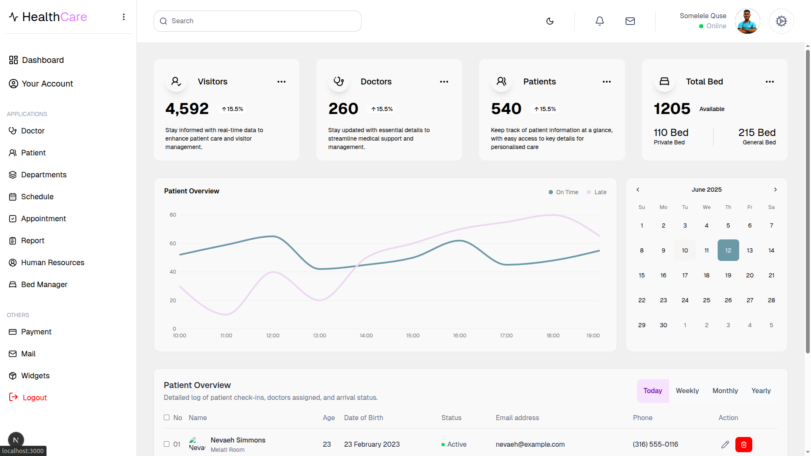
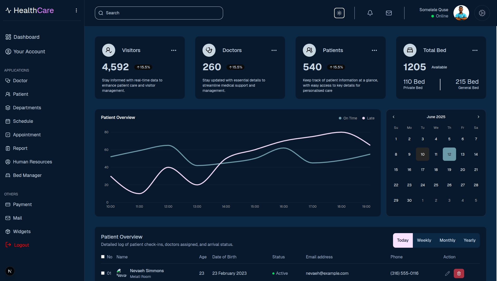

# Healthcare Dashboard UI

## Overview
A modern, responsive healthcare dashboard built with Next.js and React, designed to provide comprehensive healthcare analytics and patient management capabilities. This application leverages the power of TypeScript for type safety and Tailwind CSS for seamless styling.

## Features
- 📊 Real-time healthcare analytics
- 👥 Patient management interface
- 📈 Medical data visualization
- 🔐 Secure data handling
- 📱 Responsive design for all devices
- 🎨 Modern UI with Tailwind CSS

## Tech Stack
- Next.js 15.3.3
- React 19.0.0
- TypeScript
- Tailwind CSS
- Node.js
- npm (package manager)

## Prerequisites
Before you begin, ensure you have the following installed:
- Node.js (Latest LTS version)
- npm (comes with Node.js)

## Installation

1. Clone the repository:

***

